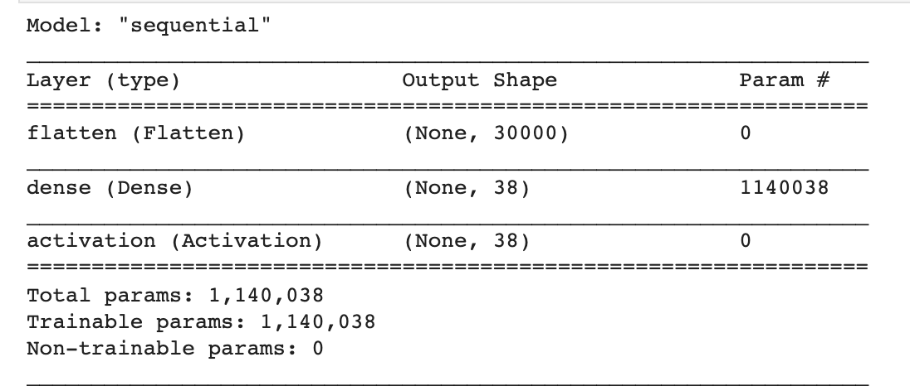
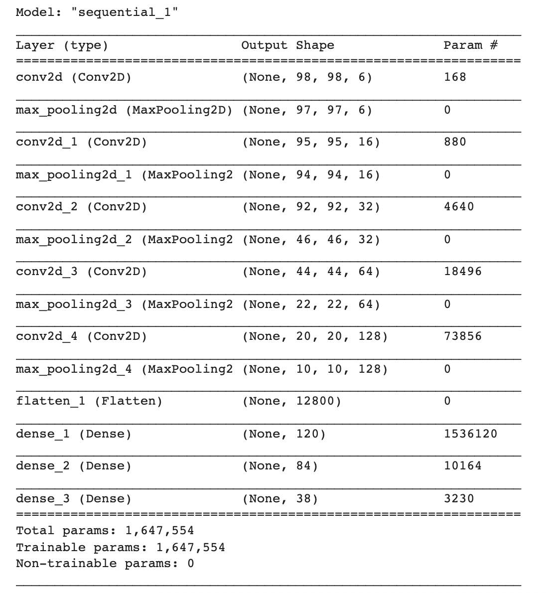

# Plant-Disease-Classification

# Project
It is used to classify plant categories based on the leaves of crops. Here I have used multinomial logistic regression and convolution neural network for classification. The dataset for this problem is obtained from kaggle https://www.kaggle.com/vipoooool/new-plant-diseases-dataset. It has 38 different classes to classify.

Dataset consists of 87k rgb images split into 80/20 ratio into train and dev set. It also has 33 test images.

These images were inputed into the model and prediction was made using multi class Logistic Regression and Convolution Neural Network using accuracy as metric.

# Mutinomial Logistic Regression
Logistic Regression can be viewed as a neural network without any hidden layer. Here I have used flatten layer and dense layer and finally softmax function to predict the output. I have used Keras and Tensorflow to build Logistic Regression instead of using SKlearn because it was difficult to run training process on 100x100x3 input image size.

# Convolution Neural Network
I have used 9 layers CNN consisting of 5 convolution layers 1 Flatten layer and 3 Dense layers. I have used Adam optimizer for the training process with learning rate = 0.001. Data augumentation is also used with shear range = 0.2 and zoom range = 0.2 along with horizontal and vertical flip. CNN model is trained for 3 epochs with the batch size of 64 images.

# Discussion
Upon training Logistic Regression model it achieved training set accuracy of 33.26% and validation set accuracy of 34.21%. Model accuracy plateau after 5 epochs. It used 1,114,038 parameters in total.

CNN model achieved a training set accuracy of 84.97% and validation set accuracy of 82.72%. Model accuracy plateau after 3 epochs. It used 1,647,554 parameters.

